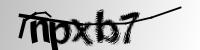

# CAPTCHA Solver using CNNs

## 📌 Overview
This project implements a deep learning model to automatically solve 5-character CAPTCHAs using Convolutional Neural Networks (CNNs).  
The model is trained on a dataset of CAPTCHA images (letters + digits) and achieves high accuracy in recognizing both individual characters and full CAPTCHA strings.

## 🚀 Features
- CNN-based multi-output classification model (TensorFlow/Keras).
- Custom preprocessing with OpenCV (grayscale conversion, normalization).
- Character-level and full CAPTCHA accuracy metrics.
- Visualization of training/validation loss and accuracy.
- Prediction pipeline for new CAPTCHA images.
- (Optional) Streamlit/Gradio app for real-time testing.

## 📂 Dataset
- Source: [Kaggle - CAPTCHA Version 2](https://www.kaggle.com/fournierp/captcha-version-2-images)
- Contains thousands of 5-character CAPTCHA images.

## 🧠 Model Architecture
- Input: 50×200 grayscale CAPTCHA image
- 4× Convolution + MaxPooling layers
- Flatten + Dense layers
- 5 parallel Dense softmax outputs (one for each character position)

## 📊 Results
- Character-level accuracy: 97%  
- Full CAPTCHA accuracy: 85%  
- Training and validation curves included below:
   

     
      &nbsp;&nbsp;&nbsp;&nbsp;
     
   

Example prediction: 
 
Predicted: **npxb7**

